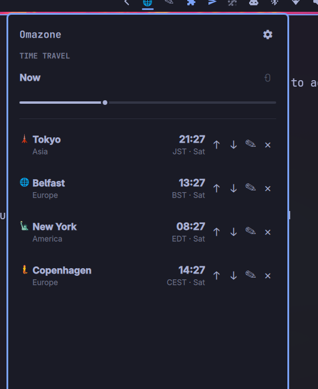

# Omazone

A multi-timezone clock for [Omarchy](https://omarchy.org/) that drops down
from a bar icon. Track any number of cities, each with its own icon and
label, and drag the Time Travel slider to see what time it'll be everywhere
at once.



## Features

- Track any number of IANA timezones, picked by searching real city/region
  names — the list always matches your system's own timezone database.
- Each city gets a fun emoji icon by default (landmarks and local flavor
  where one fits, a globe otherwise), and both the icon and the label are
  editable per city.
- **Time Travel slider** — drag it and every tracked city's clock updates
  together, so you can preview a meeting time or a future moment across all
  of them at once. Shows a +1/−1 badge when a city has rolled into a
  different calendar day than your local time.
- 12-hour or 24-hour display, your choice.
- Reorder cities, or remove ones you no longer need.
- Optional status-bar icon that drops the panel down right under it.
- The toggle keybind is rebindable from inside the panel itself — no manual
  editing of Hyprland config required.

## Install

```
omarchy plugin add https://github.com/weedwhitesandwine/omazone.git --enable
```

Run in a real terminal, this asks which bar section to place the icon in
(left/center/right, right pre-selected) before enabling it — the same
prompt any other bar-widget plugin gives you. Change your mind later with:

```
omarchy bar move io.github.weedwhitesandwine.omazone --section left
```

Add a keybind, e.g. in `~/.config/hypr/bindings.lua`:

```lua
o.bind("SUPER + I", "Toggle Omazone", "omarchy-shell shell toggle io.github.weedwhitesandwine.omazone")
```

(Or skip this — set it from the panel's own settings view instead; see
below.)

## Usage

- Open/close: your keybind, the bar icon, or
  `omarchy-shell shell toggle io.github.weedwhitesandwine.omazone`.
- Click the gear icon (top-right of the panel) to open settings:
  - **Cities** — search and check off any number of timezones to track.
  - **Format** — 12-hour or 24-hour time.
  - **Keybind** — click the current combo, press a new one (exactly one
    modifier — Super, Ctrl, Alt, or Shift), click Apply.
- On each city row: `↑`/`↓` reorder it, `✎` edit its icon and label, `✕`
  removes it.
- The Time Travel slider ranges from 24 hours in the past to 48 hours
  ahead. The reset icon next to it jumps back to now.

## External dependencies and system-level modifications

This plugin runs `bash`, `date`, `timedatectl`, `jq`, and `hyprctl` via
Quickshell's `Process` — all standard on any Omarchy install, no extra
packages required. Times are computed with the system's own `date`/tzdata,
not looked up over the network — Omazone works fully offline.

**The keybind picker in Settings modifies `~/.config/hypr/bindings.lua`.**
When you record and apply a new shortcut, `set-keybind.sh`:

1. Backs up `bindings.lua` to `bindings.lua.bak.<unix-timestamp>` (not
   auto-deleted — clean these up yourself periodically if you rebind often).
2. Rewrites the specific `o.bind(...)` line that toggles Omazone, identified
   by matching the exact `omarchy-shell shell toggle
   io.github.weedwhitesandwine.omazone` command string — no other line is
   touched.
3. Runs `hyprctl reload` and checks `hyprctl configerrors`.
4. If the reload produces any config error, restores the backup and reloads
   again — a bad rebind can't leave Hyprland in a broken state.

This is the only system configuration file this plugin ever writes to, and
only in response to an explicit action in the settings view (never
automatically).

## State files

- `~/.local/state/omarchy/omazone/settings.json` — tracked cities, their
  custom icons/labels, 12/24-hour preference, and the keybind. Created on
  first change; starts empty until you add cities from Settings.

## License

MIT — see [LICENSE](LICENSE).
